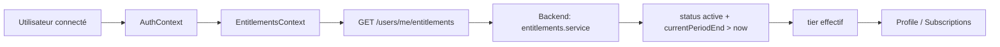

# Abonnements et droits d'accès

Ce document résume les ajustements faits autour des abonnements Earthway et explique pourquoi ils ont été nécessaires.

## Problème de départ

L'affichage de l'abonnement côté frontend reposait à plusieurs endroits sur des données de profil ou de souscription qui pouvaient être périmées. Résultat concret: un utilisateur pouvait voir un abonnement encore affiché comme premium alors que la vraie règle métier l'avait déjà considéré expiré.

La règle de vérité fonctionnelle est déjà portée par le backend via `GET /users/me/entitlements`:

- abonnement actif si `status === 'active'`
- et `currentPeriodEnd > now`

Le frontend devait donc cesser de décider seul à partir de `profile.subscription.tier` ou de `currentSub.status`.

## Ce qui a été modifié

### 1. JWT et forme de `req.user`

Dans `EarthwayBack/src/auth/strategies/jwt.strategy.ts`, la stratégie JWT renvoie maintenant les deux clés suivantes dans `req.user`:

- `id`
- `userId`

Pourquoi: plusieurs contrôleurs lisaient des formes différentes (`req.user.id` ou `req.user.userId`). En exposant les deux, on garde la compatibilité sans ajouter de couche de conversion partout.

### 2. Page profil

Dans `EarthwayFront/src/pages/Profile.tsx`, le bloc abonnement n'utilise plus `profile.subscription.tier` pour décider si l'utilisateur est abonné.

Il s'appuie désormais sur `useEntitlements().tier`:

- si `tier !== 'free'`, la carte affiche un abonnement actif
- si `tier === 'free'`, la carte affiche qu'aucun abonnement n'est actif

`profile.subscription.currentPeriodEnd` est conservé uniquement pour l'affichage de la date de renouvellement quand elle existe encore.

### 3. Page abonnements

Dans `EarthwayFront/src/pages/Subscriptions.tsx`, la page a été alignée sur la même source de vérité:

- la bannière `Abonnement actif` dépend de `useEntitlements().tier`
- le plan courant est surligné à partir du tier calculé par les entitlements
- la date de prochain prélèvement reste affichée seulement si `currentSub.currentPeriodEnd` existe

Cette page continue de charger les offres via `GET /subscriptions` et les données brutes de souscription via `GET /subscriptions/me`, mais elle ne les utilise plus pour décider du statut actif.

## Routes concernées

### Backend

- `GET /subscriptions` - liste publique des offres
- `GET /subscriptions/me` - abonnement brut rattaché à l'utilisateur
- `POST /subscriptions` - création d'une session Stripe Checkout
- `POST /subscriptions/upgrade` - changement vers un tier supérieur
- `POST /subscriptions/downgrade` - changement vers un tier inférieur
- `DELETE /subscriptions/:id` - annulation
- `GET /users/me/entitlements` - source de vérité pour les droits et le tier effectif

### Frontend

- `/profile` - affiche maintenant le tier calculé par les entitlements
- `/subscriptions` - affiche maintenant l'état actif à partir des entitlements

## Pourquoi cette approche

Cette séparation règle trois problèmes:

1. éviter d'afficher un abonnement expiré comme encore actif
2. centraliser la logique métier côté backend
3. garder le frontend simple: il consomme un tier calculé, sans réimplémenter la règle de validité

## Flux de vérité retenu

## État actuel à retenir

- `profile.subscription` reste utile pour des données brutes comme `currentPeriodEnd` ou `id`
- `useEntitlements().tier` est la seule source à utiliser pour savoir si l'abonnement est considéré actif
- la logique d'affichage a été harmonisée entre profil et page abonnements
