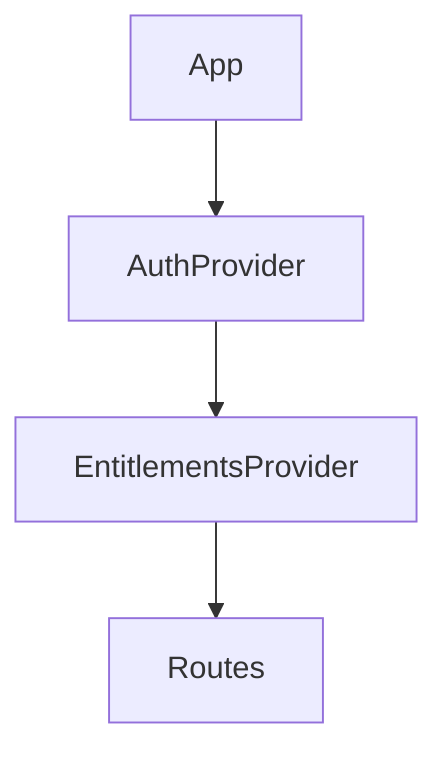
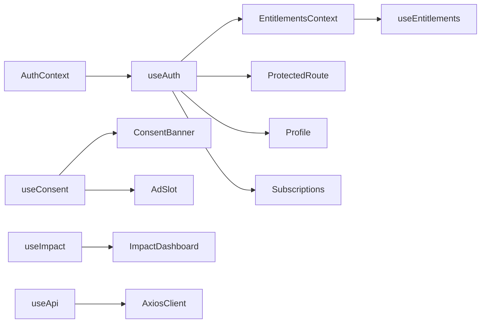

# Contextes React et consommation dans Earthway Front

Ce document recense les contextes et hooks transverses du frontend React/Vite/Tailwind, leur rôle, et les endroits où ils sont consommés.

## Vue d'ensemble

Le frontend s'appuie sur deux vrais contextes React, placés au niveau racine de l'application:

- `AuthProvider`
- `EntitlementsProvider`

Autour de cela, plusieurs hooks d'accès simplifient la consommation des données transverses:

- `useAuth`
- `useEntitlements`
- `useConsent`
- `useImpact`
- `useApi`

## Arborescence des providers

Dans `EarthwayFront/src/App.tsx`, l'ordre est le suivant:

1. `AuthProvider`
2. `EntitlementsProvider`
3. `Layout` et le reste de l'application

Cet ordre est important: `EntitlementsProvider` dépend de `useAuth()` pour savoir si l'utilisateur est connecté et pour appeler `/users/me/entitlements` avec le bon token.

## 1. AuthContext

### Fichier

- [EarthwayFront/src/context/AuthContext.tsx](../EarthwayFront/src/context/AuthContext.tsx)
- [EarthwayFront/src/Hooks/useAuth.tsx](../EarthwayFront/src/Hooks/useAuth.tsx)

### Rôle

Gère l'état d'authentification global:

- `user`
- `accessToken`
- `refreshToken`
- `isAuthenticated`
- `isLoading`
- actions `login`, `register`, `logout`, `setUser`, `setTokens`

Au montage, si un `accessToken` existe en `localStorage`, le provider recharge `/users/me` pour reconstruire la session côté frontend.

### Consommation

Le hook `useAuth()` est utilisé par:

- `App.tsx` pour le callback OAuth et `setTokens`
- `ProtectedRoute.tsx` pour protéger les routes privées
- `nav.tsx` pour afficher les actions liées à l'état connecté
- `Login.tsx` et `Register.tsx` pour appeler `login` et `register`
- `Profile.tsx` pour `logout`
- `Subscriptions.tsx` pour savoir si l'utilisateur est connecté avant de lancer un checkout
- `AdSlot.tsx` pour savoir si l'utilisateur est abonné et masquer la publicité
- `EntitlementsContext.tsx` pour déclencher la récupération des droits uniquement si l'utilisateur est authentifié

## 2. EntitlementsContext

### Fichier

- [EarthwayFront/src/context/EntitlementsContext.tsx](../EarthwayFront/src/context/EntitlementsContext.tsx)
- [EarthwayFront/src/Hooks/useEntitlements.ts](../EarthwayFront/src/Hooks/useEntitlements.ts)

### Rôle

Expose la vérité fonctionnelle des droits d'accès:

- `entitlements`
- `tier`
- `loading`
- `error`
- `has(entitlement)`
- `refetch()`

Il appelle `GET /users/me/entitlements`, puis stocke le tier effectif calculé côté backend.

Le provider se recharge aussi quand un événement global `subscription:updated` est émis, ce qui permet de rafraîchir les droits après un changement d'abonnement.

### Consommation

Le hook `useEntitlements()` est utilisé par:

- `Gate.tsx` pour afficher un contenu seulement si un droit est présent
- `Profile.tsx` pour afficher le bon statut d'abonnement
- `Subscriptions.tsx` pour afficher le plan actif et l'état des cartes

## 3. useConsent

### Fichier

- [EarthwayFront/src/Hooks/useConsent.ts](../EarthwayFront/src/Hooks/useConsent.ts)

### Rôle

Gère localement le consentement publicitaire:

- `consent` vaut `granted`, `denied` ou `null`
- l'état est persisté dans `localStorage` sous `earthway_ad_consent`
- expose `grantConsent()` et `denyConsent()`

Ce hook ne dépend pas du backend.

### Consommation

Utilisé par:

- `ConsentBanner.tsx` pour afficher le bandeau et enregistrer le choix
- `AdSlot.tsx` pour décider si un slot pub peut être affiché

## 4. useImpact

### Fichier

- [EarthwayFront/src/Hooks/useImpact.tsx](../EarthwayFront/src/Hooks/useImpact.tsx)

### Rôle

Charge l'impact utilisateur via `impactService.getMyImpact()` et expose:

- `impact`
- `loading`
- `error`

### Consommation

Utilisé par:

- `ImpactDashboard.tsx`

## 5. useApi

### Fichier

- [EarthwayFront/src/Hooks/UseApi.tsx](../EarthwayFront/src/Hooks/UseApi.tsx)

### Rôle

Retourne l'instance Axios partagée via `useMemo`.

Ce hook est un utilitaire léger, sans état métier.

### Consommation

Pas de consommateur repéré dans l'inventaire actuel, mais il reste disponible pour les composants qui veulent accéder directement au client HTTP partagé.

## Résumé des dépendances

## Règle à retenir

- `useAuth()` porte l'état de session et l'utilisateur
- `useEntitlements()` porte les droits effectifs et le tier réel
- `useConsent()` porte le consentement publicitaire local
- `useImpact()` porte les données d'impact
- `useApi()` porte seulement le client HTTP

Dans les écrans métier, il faut toujours choisir le hook qui correspond à la vérité du domaine concerné, plutôt que relire directement l'objet brut récupéré au premier chargement.
